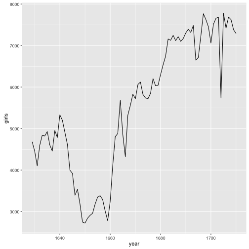
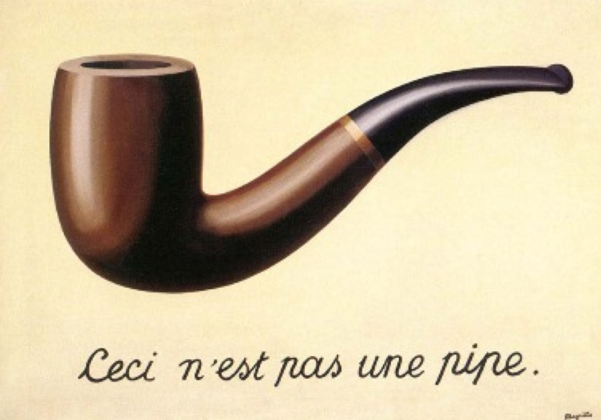

Grammar in R
========================================================
autosize: true
incremental: true


The essential sentence
========================================================


A general format:


```r
function(argument1, argument2, ...)
```

Telling R what you want it to do (the *function*) and how it should do it / what
it should do it to (the *arguments*).


```r
a <- function(argument1, argument2, ...)
```

You can save the output by *assigning* it to a new object; otherwise it's printed
to the console.


Example
========================================================


```r
x <- c(4, 7, 7, 8, 9)
sum(x)
```

```
[1] 35
```

```r
a <- sum(x)
a
```

```
[1] 35
```


Will this work?
========================================================
type: prompt

example: 


```r
sum(x
```

No! Parentheses must be balanced (quotation marks too).


Will this work?
========================================================
type: prompt

example: 


```r
sum(      x    )
```

```
[1] 35
```

Yes! Spaces generally do not matter.

A sentence involving a dataframe
========================================================

Length returns the length of a vector (column or row)


```r
data(arbuthnot)
length(arbuthnot$year)
```

```
[1] 82
```

Here we pull out the `year` column from the `arbuthnot` data frame using the
`$`.


An alternative sentence involving a dataframe
========================================================

For a graphic...


```r
qplot(x = year,y =girls, data = arbuthnot, geom="line")
```

Here, the function knows which in data frame to find `year` and `girls`, so 
there is no need for the `$`.


```r
p <- qplot(x = year,y =girls, data = arbuthnot, geom="line")
p
```


Will this work?
========================================================
type: prompt

example:


```r
qplot(year,y =girls, data = arbuthnot, geom="line")
```



Yes! If you don't name your arguments, R will guess based on their order.

Even so, it's a good idea to name your arguments.


The pipe
========================================================




Exercise 8
========================================================
What is the tail number of the plane with the fastest avg_speed? Hint: If you just want to show the avg_speed and tailnum and none of the other variables, use the select function at the end of your pipe to select just these two variables with select(avg_speed, tailnum). You can google this tail number to find out more about the aircraft.


